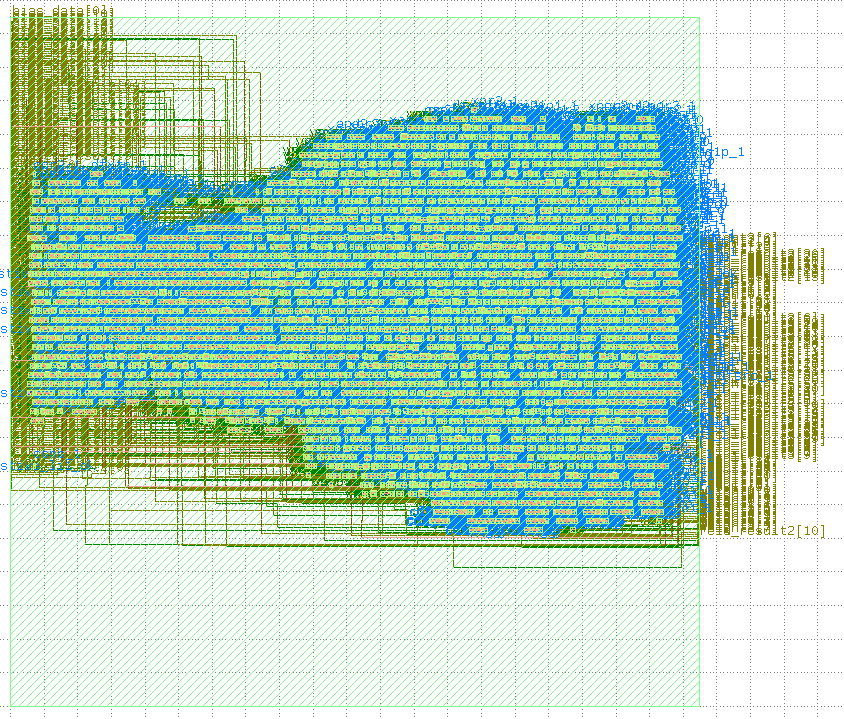
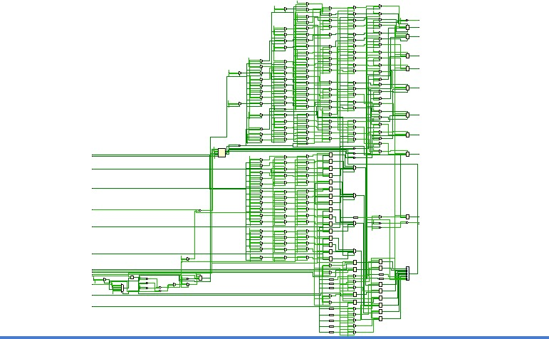
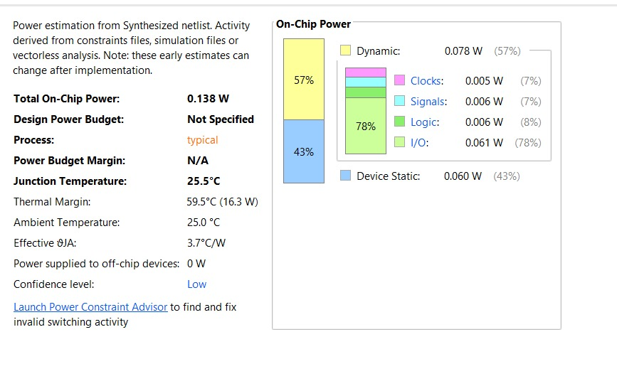
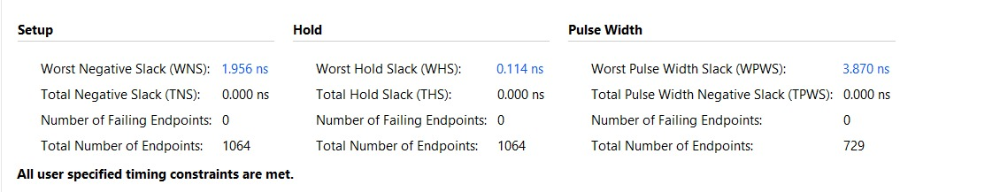
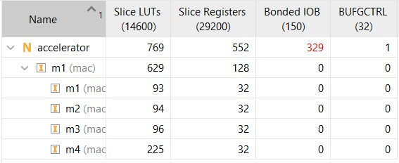

# 4-Neuron MAC-Based AI Accelerator ASIC

A small neural-network accelerator designed in Verilog, featuring four parallel MAC units for INT8 computations and implemented through an RTL-to-GDS ASIC design flow using the Sky130HD standard-cell library.

## Overview

This project implements a hardware accelerator capable of performing computations for **4 neurons in parallel**. It performs signed 8-bit multiplication and 32-bit accumulation, followed by bias addition, ReLU activation, and INT8 quantization with saturation.

The design was synthesized and taken through physical implementation to generate a routed ASIC layout.

## Key Features

- 4 parallel Multiply-Accumulate (MAC) units
- Signed INT8 inputs and weights
- 32-bit accumulators
- Bias addition and ReLU activation
- INT8 quantization with saturation
- FSM-controlled computation: `IDLE → CLEAR → LOAD_WEIGHT → COMPUTE → STORE → DONE`
- Functional verification using a simulation testbench

## Architecture

```text
        Inputs / Weights
               |
      +-------------------+
      |  4 Parallel MACs  |
      +-------------------+
               |
       32-bit Accumulators
               |
         Bias Addition
               |
         ReLU Activation
               |
       INT8 Quantization
               |
             Output
```

## ASIC Design Flow

```text
Verilog RTL
    ↓
Functional Simulation
    ↓
Yosys Synthesis
    ↓
Sky130HD Cell Mapping
    ↓
OpenROAD Physical Design
    ↓
Timing Analysis & Optimization
    ↓
Routed Layout
    ↓
GDSII Generation
```

## Timing Results

| Metric | Result |
|---|---:|
| Clock Constraint | 10 ns (100 MHz) |
| Data Arrival Time | 10.13 ns |
| Data Required Time | 10.47 ns |
| Setup Slack | +0.34 ns (MET) |

The earlier setup timing violation was resolved through timing-driven placement and physical-design optimization.

## Physical Design Results

### ASIC Floorplan



### Gate-Level Design



### Power Analysis



### Timing Analysis



### Resource Utilization



## Tools & Technologies

- **RTL Design:** Verilog / SystemVerilog
- **Synthesis:** Yosys
- **Physical Design:** OpenROAD
- **Standard-Cell Library:** Sky130HD
- **Layout Inspection:** KLayout
- **Timing Constraints:** SDC
- **Environment:** Linux

## Repository Structure

```text
4-Neuron-MAC-Based-AI-Accelerator-ASIC/
├── constraints/
├── images/
│   ├── Floorplan.png
│   ├── gate_level.jpeg
│   ├── power.jpeg
│   ├── timing.jpeg
│   └── utilization.jpeg
├── netlist/
├── accelerator.v
├── accelerator.sv
├── accelerator.dot
├── accelerator.png
├── accelerator.svg
├── accelerator_final.db
├── accelerator_final.def
├── accelerator_final.gds
├── accelerator_final.v
├── openroad.tcl
├── synth.tcl
└── README.md
```

## Final Outputs

| File | Description |
|---|---|
| `accelerator_final.gds` | Final GDSII layout |
| `accelerator_final.def` | Physical design description |
| `accelerator_final.v` | Final netlist |
| `accelerator_final.db` | Physical-design database |

## Outcome

Successfully completed an RTL-to-GDS implementation of a 4-neuron MAC-based AI accelerator, including synthesis, physical design, timing optimization, and routed layout generation.

This project demonstrates practical experience in digital hardware design, functional verification, standard-cell synthesis, timing analysis, and ASIC physical implementation.

**Status:** Educational implementation; not fabricated or silicon-validated.
